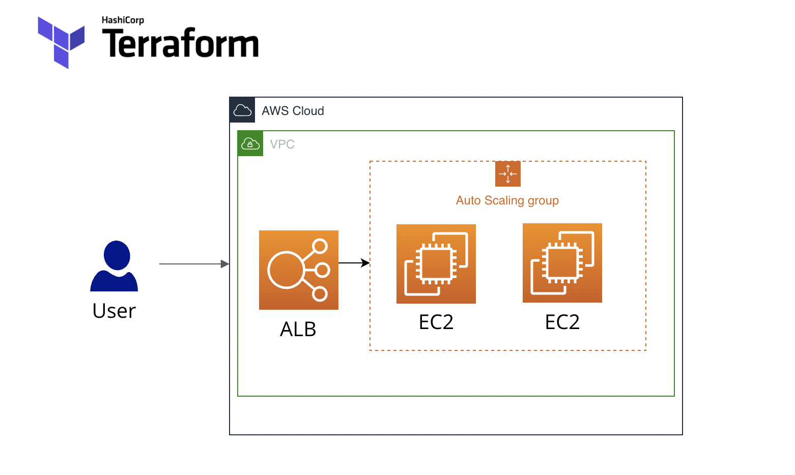

## Deploying a Cluster of Web Servers

Used Auto Scaling Group (ASG) to deploy cluster of web servers. And also used Amazon ELB to distribute traffic across the Auto Scaling Group.

					Architectural Diagram 

				Creating Cluster of Webservers using ALB and ASG with Terraform
